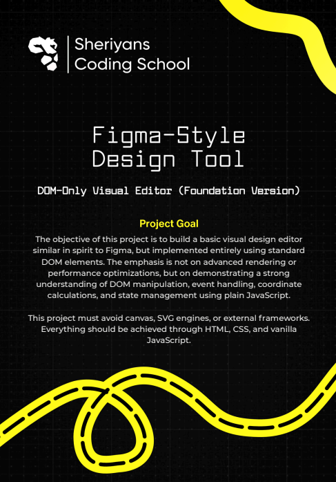

# 🎨 Figma Style Design Tool

A browser-based **Figma-inspired design editor** built using **pure HTML, CSS, and Vanilla JavaScript**, focusing on core editor concepts like selection, layers, properties, and persistence.

# Detailed video description 
Watch the full walkthrough here: [Figma Style Design Tool - Google Drive](https://drive.google.com/drive/folders/1fZrpfj_OYMvN9MZhwODL1mMjW5UoAvSm?usp=sharing)

## Functions & Features Explanation

- **Canvas Area**
  The canvas size is fixed at **4000px × 4000px**, providing a large workspace. A grid background helps with alignment and layout precision.

- **Element Creation**
  Rectangles and text boxes are added using toolbar icons. Every new element is immediately tracked internally for saving and exporting.

- **Selection Logic**
  An element must be selected before any action like drag, resize, edit, or delete. Selected elements are visually highlighted.

- **Drag Functionality**
  Dragging works only after selecting an element. This avoids accidental movement and keeps interactions intentional.

- **Edit / Resize Mode**
  The **Edit (pencil) icon** enables resize mode. Resize handles appear only in this mode to keep the UI clean.

- **Rotation**
  Elements can be rotated using **Alt + Mouse Drag**, allowing smooth and controlled rotation.

- **Properties Panel**
  The properties panel appears when an element is selected and edit mode is active. It allows real-time editing of:
  - Width and Height
  - Background color (rectangle & text)
  - Text content
  - Text color
  - Bold, Italic, Underline styles

- **Text Editing Behavior**
  Text boxes are editable directly on the canvas. Empty text boxes are automatically removed when focus is lost.

- **Layer Management**
  A layers panel shows all elements:
  - Clicking a layer selects the element
  - Move Up / Move Down controls z-index order
  - Layer order is synced visually and internally

- **Delete Functionality**
  Pressing the **Delete key** removes the selected element from the canvas and storage.

- **Keyboard Controls**
  Arrow keys move selected elements slightly for precise positioning.

- **Auto Save (Persistence)**
  All changes are automatically saved using **localStorage**, so the design restores correctly on page refresh.

- **Export JSON**
  Exports the complete layout as a JSON file including position, size, styles, text, and layer order.

- **Export HTML**
  Exports a basic HTML file that visually recreates the current canvas using inline styles.

## 🚀 What You Can Do
- Create **rectangles** and **text elements**
- Select, drag, resize (4-corner), and rotate elements
- Edit properties via a dynamic **Properties Panel**
- Manage element order using a **Layers Panel**
- Style text: **Bold / Italic / Underline / Color**
- Background & text color editing
- Keyboard controls (Delete, Arrow keys, Escape)
- Auto-save design using **localStorage**
- Export designs as **JSON** or **HTML**

## 🖼 Preview

## 🧩 Editor Architecture (Conceptual)
- DOM-based element rendering (no `<canvas>`)
- Central state management via a layout array
- Z-index driven visual layering
- Real-time UI ↔ data binding
- Persistent layout reconstruction on reload

## 💾 Persistence & Recovery
- Layout stored as a simple array of objects
- Each element saves:
  - Position
  - Size
  - Rotation
  - Colors & text styles
  - Layer order
- Refreshing the page restores the exact design state

## 📤 Export Options
- **JSON Export** → raw editor data (for storage or reuse)
- **HTML Export** → visual reproduction using inline styles

## 🎯 Why This Project Matters
- Demonstrates understanding of:
  - Interactive UI design
  - State synchronization
  - Editor-style workflows
  - DOM manipulation without libraries
- Inspired by real tools like **Figma / Canva**

## 🛠 Built With
HTML • CSS • JavaScript (No frameworks, No libraries)

---
